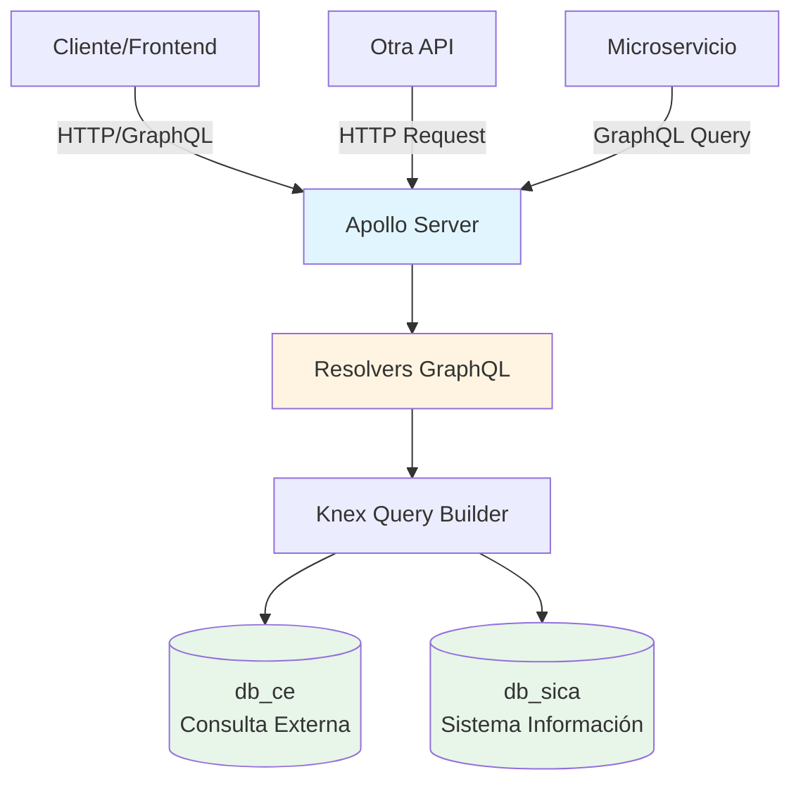
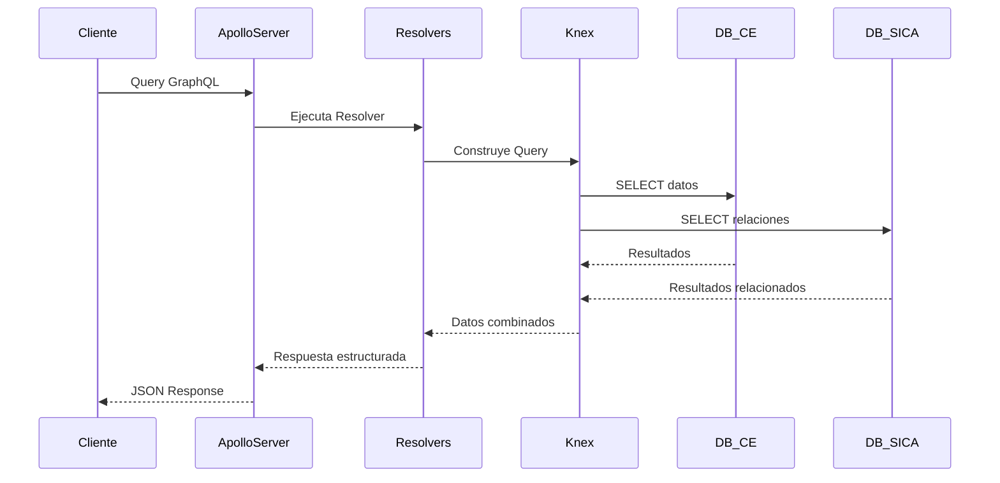
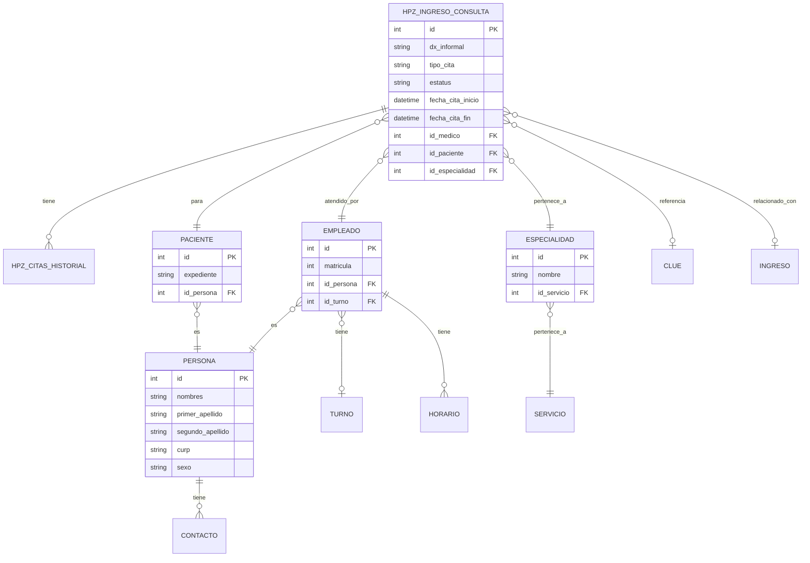
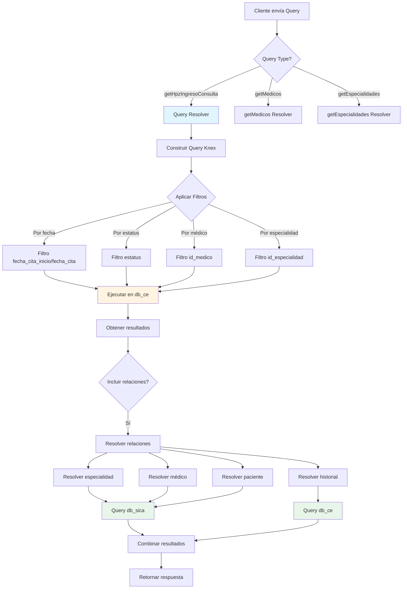
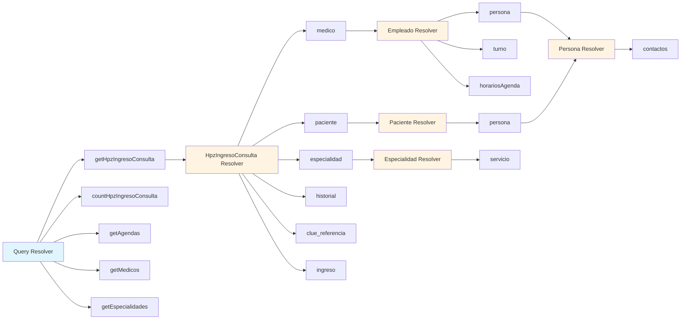
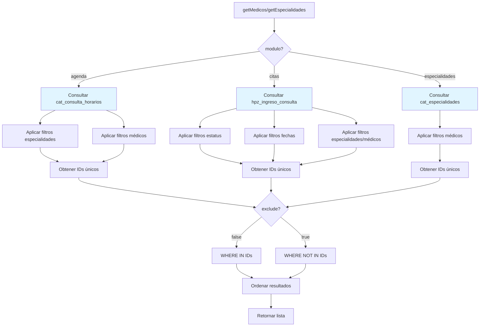

# API GraphQL - Sistema de Consulta Externa

API GraphQL desarrollada con Apollo Server que proporciona acceso unificado a múltiples bases de datos del sistema de salud, permitiendo consultas eficientes de información relacionada con consultas externas, médicos, pacientes, especialidades y más.

## 📋 Tabla de Contenidos

- [Descripción](#descripción)
- [Arquitectura](#arquitectura)
- [Tecnologías](#tecnologías)
- [Instalación](#instalación)
- [Configuración](#configuración)
- [Estructura del Proyecto](#estructura-del-proyecto)
- [Queries Disponibles](#queries-disponibles)
- [Ejemplos de Uso](#ejemplos-de-uso)
- [Integración con Otras APIs](#integración-con-otras-apis)
- [Diagramas](#diagramas)

## 🎯 Descripción

Esta API GraphQL actúa como una capa de abstracción que unifica el acceso a dos bases de datos principales:

- **db_ce**: Base de datos de Consulta Externa (citas, horarios, historial)
- **db_sica**: Base de datos del Sistema de Información (empleados, pacientes, personas, especialidades)

La API permite realizar consultas complejas con relaciones entre entidades, filtros avanzados y paginación, facilitando la integración con aplicaciones frontend y otras APIs.

## 🏗️ Arquitectura

### Diagrama de Arquitectura General



### Flujo de Datos



## 🛠️ Tecnologías

- **Node.js**: Runtime de JavaScript
- **TypeScript**: Lenguaje de programación
- **Apollo Server**: Servidor GraphQL
- **GraphQL**: Lenguaje de consulta
- **Knex.js**: Query builder para SQL
- **MySQL2**: Driver de MySQL
- **dotenv**: Gestión de variables de entorno
- **moment**: Manipulación de fechas

## 📦 Instalación

### Requisitos Previos

- Node.js (v14 o superior)
- npm o yarn
- Acceso a las bases de datos MySQL (db_ce y db_sica)

### Pasos de Instalación

1. **Clonar el repositorio**

```bash
git clone https://gitlab.ssaver.gob.mx/graphql/api-graphql.git
cd api-graphql
```

2. **Instalar dependencias**

```bash
npm install
```

3. **Compilar TypeScript**

```bash
tsc -w
```

4. **Configurar variables de entorno** (ver sección de Configuración)

5. **Iniciar el servidor**

```bash
# Modo desarrollo
npm run dev

# Para desplegar en produccion seguir el flujo establecido en base a contenedores
```

## ⚙️ Configuración

Crear un archivo `.env` en la raíz del proyecto con las siguientes variables:

```env
# Puerto del servidor GraphQL
PORT_API_GRAPH=3000

# Configuración Base de Datos Consulta Externa (db_ce)
DB_CE_HOST=localhost
DB_CE_PORT=3306
DB_CE_PASSWORD=tu_password

# Configuración Base de Datos SICA (db_sica)
DB_SICA_HOST=localhost
DB_SICA_PORT=3306
DB_SICA_PASSWORD=tu_password

# Ambiente (develop/production)
ENVIRONMENT=develop
```

## 📁 Estructura del Proyecto

```
api-graphql/
├── src/
│   ├── db/                    # Configuración de conexiones a BD
│   │   ├── index.ts           # Exportaciones de conexiones
│   │   ├── knexCe.ts          # Conexión a db_ce
│   │   └── knexSica.ts        # Conexión a db_sica
│   ├── graphql/
│   │   ├── index.ts           # Exportaciones principales
│   │   ├── schema.ts          # Schema GraphQL principal
│   │   ├── resolvers/         # Resolvers de GraphQL
│   │   │   ├── Query.ts       # Queries principales
│   │   │   ├── db_ce/         # Resolvers para db_ce (IngresoConsulta, etc.)
│   │   │   └── db_sica/       # Resolvers para db_sica (Empleado, Especialidad, etc.)
│   │   └── schemas/           # Definiciones de queries y tipos
│   │       ├── AgendasQueries.ts
│   │       ├── AgendasTypes.ts
│   │       └── index.ts
│   ├── interfaces/            # Interfaces TypeScript
│   │   ├── db_ce/             # Interfaces para db_ce (HpzIngresoConsulta, etc.)
│   │   ├── db_sica/           # Interfaces para db_sica (RchEmpleados, etc.)
│   │   ├── GeneralInterface.ts
│   │   └── index.ts
│   └── index.ts               # Punto de entrada
├── package.json
├── tsconfig.json
└── README.md
```

## 🔍 Queries Disponibles

### 1. getHpzIngresoConsulta

Obtiene una lista paginada de ingresos de consulta con filtros avanzados.

**Parámetros:**

- `page`: Número de página (Int)
- `page_size`: Tamaño de página (Int)
- `estatus`: Estados separados por comas (String, opcional)
- `start_date`: Fecha de inicio (String, formato: YYYY-MM-DD)
- `end_date`: Fecha de fin (String, formato: YYYY-MM-DD)
- `switch_fecha`: Tipo de filtro de fecha ("true", "false", "otros")
- `radio_fecha`: Tipo de fecha (0: fecha_cita_inicio, 1: fecha_cita)
- `especialidades`: IDs de especialidades separados por comas (String)
- `id_medico`: ID del médico (Int)
- `id_paciente`: ID del paciente (Int)
- `id_especialidad`: ID de especialidad (Int)
- `via_ingreso`: Vía de ingreso (String, requerido)

**Retorna:** `[HpzIngresoConsulta]`

### 2. countHpzIngresoConsulta

Cuenta el total de registros que coinciden con los filtros aplicados.

**Parámetros:** (Mismos que getHpzIngresoConsulta, sin page y page_size)

**Retorna:** `totalRows` con campo `total`

### 3. getAgendas

Obtiene las agendas de un médico específico.

**Parámetros:**

- `id_medico`: ID del médico (Int)
- `especialidades`: IDs de especialidades separados por comas (String)

**Retorna:** `[HpzAgendas]`

### 4. getMedicos

Obtiene una lista de médicos con filtros según el módulo.

**Parámetros:**

- `limit`: Límite de resultados (Int, opcional)
- `text`: Texto de búsqueda por nombre o matrícula (String, opcional)
- `modulo`: Módulo de filtrado ("agenda", "citas", "empleados")
- `estatus`: Estados separados por comas (String, opcional)
- `exclude`: Incluir/excluir ("true"/"false")
- `medicos`: IDs de médicos separados por comas (String)
- `start_date`: Fecha de inicio (String)
- `end_date`: Fecha de fin (String)
- `especialidades`: IDs de especialidades separados por comas (String)

**Retorna:** `[Empleado]`

### 5. getEspecialidades

Obtiene una lista de especialidades con filtros según el módulo.

**Parámetros:**

- `modulo`: Módulo de filtrado ("agenda", "citas")
- `estatus`: Estados separados por comas (String, opcional)
- `exclude`: Incluir/excluir ("true"/"false")
- `medicos`: IDs de médicos separados por comas (String)
- `start_date`: Fecha de inicio (String)
- `end_date`: Fecha de fin (String)
- `especialidades`: IDs de especialidades separados por comas (String)

**Retorna:** `[Especialidad]`

## 💡 Ejemplos de Uso

### Ejemplo 1: Obtener Citas de Consulta con Paginación

```graphql
query ObtenerCitas {
  getHpzIngresoConsulta(
    page: 1
    page_size: 10
    estatus: "AGENDADA, EXTRAORDINARIA"
    start_date: "2024-01-01"
    end_date: "2024-12-31"
    switch_fecha: "true"
    radio_fecha: 0
    via_ingreso: "CONSULTA_EXTERNA"
  ) {
    id
    dx_informal
    tipo_cita
    estatus
    fecha_cita_inicio
    fecha_cita_fin
    especialidad {
      id
      nombre
      servicio {
        id
        nombre
      }
    }
    medico {
      id
      matricula
      persona {
        nombres
        primer_apellido
        segundo_apellido
      }
    }
    paciente {
      id
      expediente
      persona {
        nombres
        primer_apellido
        segundo_apellido
        curp
      }
    }
  }
  countHpzIngresoConsulta(
    estatus: "AGENDADA, EXTRAORDINARIA"
    start_date: "2024-01-01"
    end_date: "2024-12-31"
    switch_fecha: "true"
    radio_fecha: 0
    via_ingreso: "CONSULTA_EXTERNA"
  ) {
    total
  }
}
```

### Ejemplo 2: Obtener Médicos

```graphql
query ObtenerMedicosAgenda {
  getMedicos(
    estatus: ""
    medicos: ""
    exclude: "false"
    modulo: "citas"
    end_date: "2025-12-31"
    especialidades: "1,2,3"
    start_date: "2025-01-01"
  ) {
    id
    matricula
    persona {
      nombres
      primer_apellido
      segundo_apellido
      curp
    }
    turno {
      id
      nombre
    }
    agendas {
      id
      fecha_inicio
      fecha_fin
      id_especialidad
      especialidad {
        id
        nombre
      }
      horarios {
        id
        dia
        hora_inicio
        hora_fin
      }
    }
  }
}
```

### Ejemplo 3: Obtener Especialidades con Filtros

```graphql
query ObtenerEspecialidades {
  getEspecialidades(
    estatus: ""
    medicos: ""
    exclude: "false"
    modulo: "citas"
    end_date: "2025-12-31"
    especialidades: "1,2,3"
    start_date: "2025-01-01"
  ) {
    id
    nombre
    id_servicio
    servicio {
      id
      nombre
    }
  }
}
```

### Ejemplo 4: Consulta Completa con Relaciones

```graphql
query ConsultaCompleta {
  getHpzIngresoConsulta(
    page: 1
    page_size: 5
    id_medico: 123
    id_especialidad: 5
    via_ingreso: "CONSULTA_EXTERNA"
  ) {
    id
    dx_informal
    estatus
    fecha_cita_inicio
    especialidad {
      nombre
      servicio {
        nombre
      }
    }
    medico {
      matricula
      persona {
        nombres
        primer_apellido
        segundo_apellido
        contactos {
          tipo
          descripcion
        }
      }
      turno {
        nombre
      }
    }
    paciente {
      expediente
      persona {
        nombres
        primer_apellido
        segundo_apellido
        sexo
        curp
        contactos {
          tipo
          descripcion
        }
      }
    }
    clue_referencia {
      nom_uni
    }
    historial {
      user {
        name
      }
      estatus
      created_at
    }
    ingreso {
      id
      fecha_ingreso
    }
  }
}
```

## 🔗 Integración con Otras APIs

### Uso desde Aplicaciones Frontend

La API GraphQL puede ser consumida desde cualquier aplicación frontend usando librerías como Apollo Client, Relay o fetch nativo.

#### Ejemplo con Apollo Client (React)

```typescript
import { ApolloClient, InMemoryCache, gql } from "@apollo/client";

const client = new ApolloClient({
  uri: "http://localhost:3000/graphql",
  cache: new InMemoryCache(),
  headers: {
    authorization: "Bearer tu_token_aqui",
  },
});

const GET_CITAS = gql`
  query GetCitas($page: Int!, $pageSize: Int!) {
    getHpzIngresoConsulta(page: $page, page_size: $pageSize, via_ingreso: "CONSULTA_EXTERNA") {
      id
      estatus
      fecha_cita_inicio
      medico {
        persona {
          nombres
        }
      }
    }
  }
`;

// Uso en componente
const { data, loading, error } = useQuery(GET_CITAS, {
  variables: { page: 1, pageSize: 10 },
});
```

#### Ejemplo con Fetch API (JavaScript/TypeScript)

```typescript
async function obtenerCitas() {
  const query = `
    query {
      getHpzIngresoConsulta(page: 1, page_size: 10, via_ingreso: "CONSULTA_EXTERNA") {
        id
        estatus
        fecha_cita_inicio
      }
    }
  `;

  const response = await fetch("http://localhost:3000/graphql", {
    method: "POST",
    headers: {
      "Content-Type": "application/json",
      Authorization: "Bearer tu_token_aqui",
    },
    body: JSON.stringify({ query }),
  });

  const result = await response.json();
  return result.data.getHpzIngresoConsulta;
}
```

### Uso desde Microservicios

#### Ejemplo con Node.js/Express

```typescript
import axios from "axios";

async function obtenerMedicosDesdeMicroservicio() {
  const query = `
    query {
      getMedicos(modulo: "agenda") {
        id
        matricula
        persona {
          nombres
        }
      }
    }
  `;

  try {
    const response = await axios.post(
      "http://api-graphql:3000/graphql",
      { query },
      {
        headers: {
          "Content-Type": "application/json",
          Authorization: "Bearer token_microservicio",
        },
      }
    );
    return response.data.data.getMedicos;
  } catch (error) {
    console.error("Error al consultar GraphQL:", error);
    throw error;
  }
}
```

### Uso desde Python

```python
import requests

def obtener_citas():
    query = """
    query {
      getHpzIngresoConsulta(page: 1, page_size: 10, via_ingreso: "CONSULTA_EXTERNA") {
        id
        estatus
        fecha_cita_inicio
      }
    }
    """

    response = requests.post(
        'http://localhost:3000/graphql',
        json={'query': query},
        headers={
            'Content-Type': 'application/json',
            'Authorization': 'Bearer tu_token'
        }
    )

    return response.json()['data']['getHpzIngresoConsulta']
```

### Autenticación

La API soporta autenticación mediante el header `Authorization`. El token se pasa al contexto de GraphQL y puede ser utilizado para validación y autorización.

```typescript
// El token está disponible en el contexto
context: ({ req }) => {
  return { token: req.headers.authorization || null };
};
```

## 📚 Documentación Adicional

- [Índice de Documentación](./docs/README.md) - Guía completa de toda la documentación
- [Arquitectura del Sistema](./docs/ARCHITECTURE.md) - Arquitectura GraphQL detallada
- [Documentación de API](./docs/API.md) - Especificación completa de queries
- [Servicios y Conexiones](./docs/SERVICES.md) - Detalle de conexiones a bases de datos
- [Guía de Despliegue](./docs/DEPLOYMENT.md) - Instrucciones para despliegue en producción
- [Diagramas del Sistema](./docs/DIAGRAMS.md) - Diagramas visuales de arquitectura y flujos

## 📊 Diagramas

### Modelo de Datos y Relaciones



### Flujo de Resolución de Query



### Arquitectura de Resolvers



### Proceso de Filtrado por Módulo



## 🚀 Características Principales

- ✅ **Consultas unificadas** a múltiples bases de datos
- ✅ **Relaciones complejas** entre entidades
- ✅ **Filtros avanzados** por múltiples criterios
- ✅ **Paginación** para grandes volúmenes de datos
- ✅ **Type-safe** con TypeScript
- ✅ **Introspection** habilitada para exploración del schema
- ✅ **Manejo de errores** estructurado
- ✅ **Pool de conexiones** configurado para optimización

## 📝 Notas Adicionales

- Por defecto, las consultas excluyen registros con estatus "DESHABILITADO" y "BASURA"
- El filtro de fecha por defecto muestra registros del año anterior en adelante
- Los filtros de listas (especialidades, médicos, estatus) aceptan valores separados por comas
- La paginación utiliza offset/limit estándar

## 🔒 Seguridad

- Las credenciales de base de datos deben estar en variables de entorno
- En producción, deshabilitar introspection si no es necesaria
- Implementar rate limiting según necesidades
<!-- - El token de autorización se valida en el contexto de GraphQL -->

---